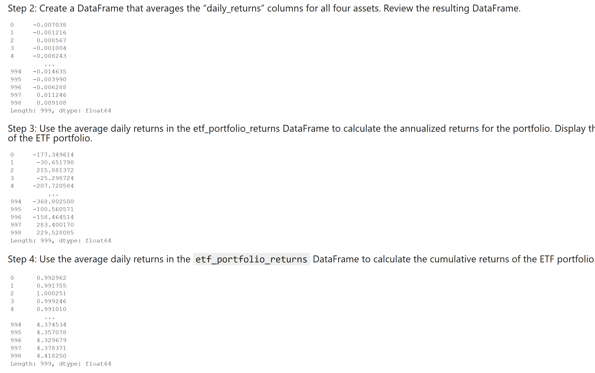

<div id="top"></div>
<br />

<h3 align="center">ETF Analyzer</h3>

  <p align="center">
  ETF Analyzer is a web application that utilizes a financial database and Voila to analyze the performance of a hypothetical ETF. 
    <a href="https://github.com/jtengsico/07-Financial-Databases-with-SQL.git">
  </p>
</div>

<!-- TABLE OF CONTENTS -->
<details>
  <summary>Table of Contents</summary>
  <ol>
    <li><a href="#built-with">Built With</a></li>
    <li><a href="#installation">Installation</a></li>
    <li><a href="#usage">Usage</a></li>
    <li><a href="#license">License</a></li>
    <li><a href="#acknowledgments">Acknowledgments</a></li>
  </ol>
</details>

<p align="right">(<a href="#top">back to top</a>)</p>

### Built With
* python 3.7 
* viola
* numpy 
* pandas 
* hvplot
* sqlalchemy

<p align="right">(<a href="#top">back to top</a>)</p>

<!-- Installation -->
### Installation 

To setup this program on your desktop, please clone the repo.
Then following the steps below: 

1. Clone the repo
   ```sh
   git clone https://github.com/jtengsico/07-Financial-Databases-with-SQL.git
   ```
2. Install required python packages listed in the Built With section. 
3. Then navigate to the folder in your terminal and open the program in jupyter notebook. 
4. On your jupyter notebook, there should be a small button that says Viola. Click it to launch the ipynb file into a web application. 

<p align="right">(<a href="#top">back to top</a>)</p>

<!-- Usage -->
### Usage

1. Launch jupyter notebook into a Viola web app. Screenshot of address and proof that it was locally launched. 


2. Pypl Dataframe


3. Graph of daily returns


4. Graphy of cumulative returns


5. Closing prices for Pypl higher than 200
  

6. The top 10 returns for Pypl
  

7. ETF Dataframe


8. ETF annualized and cumulative returns


9. Graph of ETF cumulative returns

 
<p align="right">(<a href="#top">back to top</a>)</p>

<!-- LICENSE -->
### License

Distributed under the MIT License.
See [license txt](https://github.com/git/git-scm.com/blob/main/MIT-LICENSE.txt)

<p align="right">(<a href="#top">back to top</a>)</p>

<!-- ACKNOWLEDGMENTS -->
### Acknowledgments
Credit to creator of readme template. The repo also has useful resources. 
* [README Template](https://github.com/othneildrew/Best-README-Template.git)

<p align="right">(<a href="#top">back to top</a>)</p>
